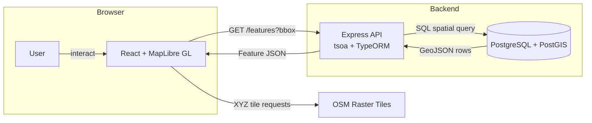
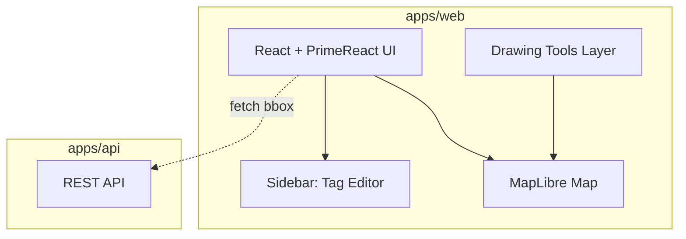
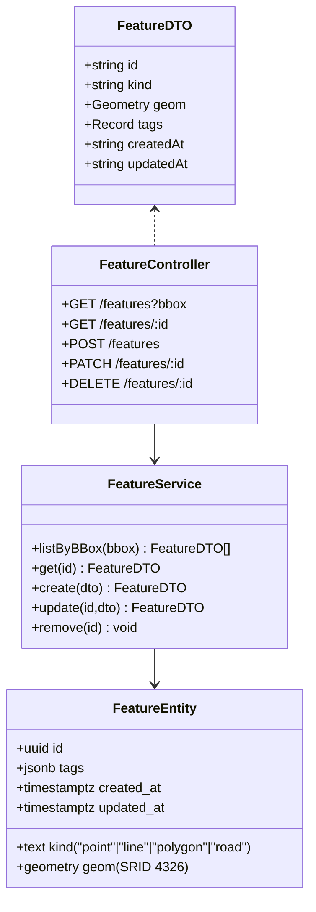
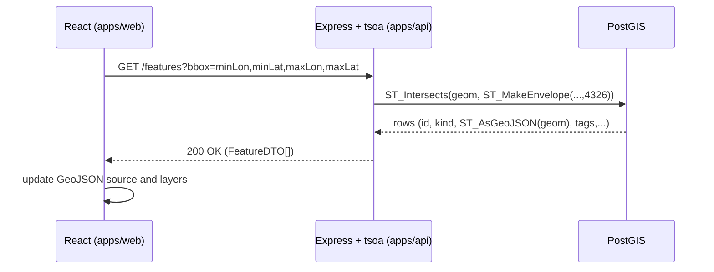
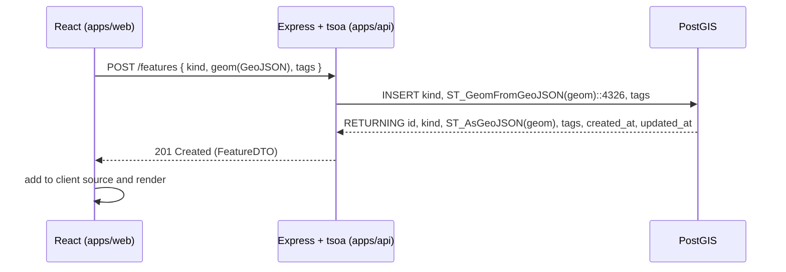
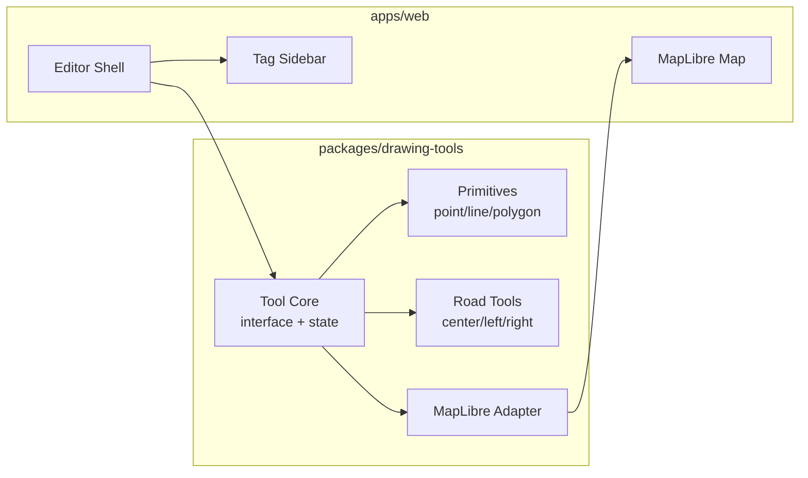
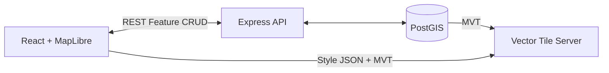

# Architecture — Map Editor

This document explains **how the tech stack fits together** for the Map Editor prototype and its next steps. It includes system context, runtime data flows, a resource‑centric API structure, and future vector‑tile migration.

---

## 1) System Overview

- **Frontend (apps/web)**: React + Vite + TypeScript; **MapLibre GL** for map rendering (OSM *raster* tiles in the prototype).
- **Backend (apps/api)**: Express + **tsoa** (OpenAPI + generated routes) + TypeORM; **resource‑centric** folder layout.
- **Database**: PostgreSQL + **PostGIS** (SRID **4326** / WGS84).
- **Basemap**: OSM raster tiles (`tile.openstreetmap.org`) with attribution; migrate later to **self‑hosted vector tiles** from PostGIS.
- **Edits**: Stored in private PostGIS; **no syncing to public OSM**.

### High-level data flow



---

## 2) Mono‑repo layout

```text
repo-root/
├─ apps/
│  ├─ web/                               # React + Vite + TS (MapLibre GL)
│  │  ├─ index.html                      # Vite entry HTML (mount point)
│  │  ├─ tsconfig.json                   # Project TS config (extends root)
│  │  ├─ vite.config.ts                  # Vite config (aliases, plugins)
│  │  └─ src/
│  │     ├─ main.tsx                     # createRoot + <RouterProvider/>
│  │     ├─ app/
│  │     │  ├─ routes/                   # Route modules (lazy, data loaders)
│  │     │  │  ├─ index.tsx              # Root (dashboard / map shell)
│  │     │  │  ├─ map/                   # Map editing area
│  │     │  │  │  ├─ index.tsx           # Map page (loader fetches initial bbox)
│  │     │  │  │  └─ settings.tsx        # Map settings (future)
│  │     │  │  ├─ features/
│  │     │  │  │  ├─ index.tsx           # Feature list / filter panel
│  │     │  │  │  └─ $featureId.tsx      # Feature detail (dynamic param)
│  │     │  │  └─ about.tsx              # Simple static route
│  │     │  ├─ layouts/
│  │     │  │  ├─ RootLayout.tsx         # App chrome (nav/sidebar/outlet)
│  │     │  │  └─ MapLayout.tsx          # Map-specific layout (toolbars)
│  │     │  ├─ providers/                # Top-level context/query providers
│  │     │  │  └─ AppProviders.tsx       # QueryClientProvider, Theme, etc.
│  │     │  └─ router.tsx                # createBrowserRouter definition
│  │     ├─ components/                  # Reusable presentational components
│  │     │  ├─ map/
│  │     │  │  ├─ MapContainer.tsx       # Wraps MapLibre map instance
│  │     │  │  ├─ LayerToggle.tsx        # UI to enable/disable layers
│  │     │  │  └─ Attribution.tsx        # OSM attribution footer
│  │     │  ├─ ui/                       # PrimeReact composition wrappers
│  │     │  └─ feedback/                 # LoadingSpinner, ErrorState, Empty
│  │     ├─ features/                    # Feature-oriented slices (colocated)
│  │     │  ├─ feature/                  # CRUD for spatial features
│  │     │  │  ├─ api.ts                 # API calls (thin; uses lib/apiClient)
│  │     │  │  ├─ hooks.ts               # useFeature, useFeatures(bbox)
│  │     │  │  ├─ queries.ts             # Query keys & fetch fns
│  │     │  │  ├─ components/            # Feature-specific UI widgets
│  │     │  │  └─ types.ts               # Feature-specific TS types
│  │     │  ├─ drawing/                  # Drawing tool integration glue
│  │     │  │  ├─ state.ts               # Local drawing session state (Zustand)
│  │     │  │  ├─ hooks.ts               # useDrawingMode, useSnapGuides
│  │     │  │  ├─ adapters/              # Adapters to packages/drawing-tools
│  │     │  │  └─ components/            # Toolbar, vertex handles
│  │     │  └─ tagging/                  # Tag editor logic & form schemas
│  │     ├─ drawing-tools.d.ts           # Ambient types for external pkg (if any)
│  │     ├─ hooks/                       # Cross-cutting generic hooks (e.g., useDebounce, useBBox)
│  │     ├─ lib/                         # Generic libs (api client, config)
│  │     │  ├─ apiClient.ts              # Fetch wrapper w/ auth & error mapping
│  │     │  ├─ queryClient.ts            # TanStack Query client factory
│  │     │  ├─ bbox.ts                   # BBox helpers (expand, stringify)
│  │     │  ├─ geometry.ts               # GeoJSON utilities (validation, transform)
│  │     │  ├─ auth.ts                   # (future) token handling / OIDC stub
│  │     │  └─ env.ts                    # Frontend runtime config (import.meta.env)
│  │     ├─ state/                       # Global app state (if beyond React Query)
│  │     │  └─ themeStore.ts             # e.g., dark/light mode store
│  │     ├─ styles/
│  │     │  ├─ theme.css                 # PrimeReact theme overrides (scoped)
│  │     │  ├─ variables.css             # CSS custom properties (colors, z-index)
│  │     │  └─ global.css                # Normalize + base layout
│  │     ├─ assets/                      # Static assets (logo, icons, fonts)
│  │     ├─ types/                       # Shared frontend-only type declarations
│  │     ├─ test/ or __tests__/          # Unit/integration tests (Vitest + RTL)
│  │     ├─ e2e/                         # Playwright tests (optional)
│  │     ├─ setupTests.ts                # RTL / vitest setup (msw, etc.)
│  │     ├─ msw/                         # Mock Service Worker handlers
│  │     │  └─ handlers.ts
│  │     └─ env.d.ts                     # Vite env var type augmentation
│  └─ api/                               # Express + TypeORM + tsoa
│     ├─ tsoa.json
│     ├─ tsconfig.json
│     ├─ package.json
│     └─ src/
│        ├─ server.ts                    # boot + datasource init
│        ├─ app.ts                       # express app + RegisterRoutes()
│        ├─ routes.ts                    # ⬅️ GENERATED by tsoa (do not edit)
│        ├─ spec/                        # ⬅️ GENERATED openapi.json
│        ├─ data/                        # everything in support of the database
│        │  ├─ datasource.ts             # TypeORM DataSource; entity glob comes from resources/**
│        │  ├─ migrations/               # TypeORM Migration scripts
│        │  ├─ repositories/             # TypeORM Repository using DataSource.getRepository(Entity).extend
│        │  └─ entities/                 # TypeORM Entities
│        └─ resources/
│           ├─ feature/
│           │  ├─ controller.ts          # tsoa controller (routes + validation)
│           │  ├─ service.ts             # business logic
│           │  ├─ resource.ts            # request/response types (DTOs)
│           │  └─ index.ts               # optional re-exports
│           ├─ road/                     # future lane-aware road tools
│           │  ├─ controller.ts          # tsoa controller (routes + validation)
│           │  ├─ service.ts             # business logic
│           │  ├─ resource.ts            # request/response types (DTOs)
│           │  └─ index.ts               # optional re-exports
│           └─ preset/                   # (optional) tagging presets
│              ├─ controller.ts          # tsoa controller (routes + validation)
│              ├─ service.ts             # business logic
│              ├─ resource.ts            # request/response types (DTOs)
│              └─ index.ts               # optional re-exports
├─ packages/
│  ├─ drawing-tools/                     # pluggable editor modes (web)
│  ├─ core-model/                        # shared types & small geo utilities
│  └─ api-client/                        # generated types from OpenAPI (optional)
├─ infra/                                # docker-compose, SQL bootstrap
├─ doc/                                  # (renamed from docs) ARCHITECTURE.md, ADRs, PRD
└─ pnpm-workspace.yaml
```

**Why this works**  
- Co-locates **route + feature logic** while isolating cross-cutting utilities.  
- Clear separation between **feature slices** (`src/features/*`) and **generic components** (`src/components/*`).  
- Dedicated **lib/** for stable helpers & API layer keeps import paths predictable.  
- Explicit **queryClient**, **apiClient**, **bbox** utilities encourage reuse and testability.  
- Leaves room for progressive enhancement (auth, workers, msw mocks, drawing tools adapters).

### apps/web Detailed Notes
- `app/routes/*`: Prefer React Router data APIs (loader/action) only when preloading is essential; otherwise colocated hooks in feature slice with React Query.
- `features/*`: Each slice owns: `api.ts`, `hooks.ts`, `queries.ts`, `components/`, `types.ts` (minimize surface area; re-export minimal public API).
- `components/map/*`: MapLibre integration components (render-only; no business decisions).
- `drawing/`: Houses integration behind an adapter so drawing engine can evolve independently (CRDT, collaborative editing later).
- `lib/apiClient.ts`: Central fetch wrapper adding base URL, JSON parsing, error normalization (never scatter raw fetch calls).
- `msw/handlers.ts`: Provide deterministic mocks for development & unit tests (enable offline work).
- `env.ts` & `env.d.ts`: Type-safe access to Vite `import.meta.env` variables (fail-fast for missing config keys).

---

## 3) Frontend runtime

- **Map engine**: MapLibre GL.  
- **UI Framework**: React 18 + PrimeReact (components), PrimeIcons (icons), PrimeFlex (layout utilities).  
- **State (server/cache)**: TanStack Query (queryClient in `src/lib/queryClient.ts`).  
- **Local/ephemeral state**: React hooks; Zustand only for drawing session state.  
- **Routing**: react-router-dom Data Router (`createBrowserRouter`, lazy route modules).  
- **Validation (client)**: Zod (where complex client-side forms appear) — mirrors server OpenAPI spec types (generated client in `packages/api-client`).  
- **Basemap**: OSM raster tiles.  
- **Feature layers**: A single GeoJSON source updated after fetch; separate style layers for points/lines/polygons.  
- **Drawing UX**: Click‑to‑add vertices; double‑click to finish; drag handles to edit; delete via UI button.  
- **Error / Loading UI**: Standardized components in `components/feedback/` (LoadingSpinner, ErrorState, Empty).  
- **Future**: Lane tools (center/left/right) + presets-driven tag forms; optimistic updates & real-time sync.



---

## 4) Backend runtime

### Resource‑centric Express API

- **Framework**: Express (choice: broad ecosystem + tsoa integration).  
- **Route Definition**: tsoa decorators generate `routes.ts` & OpenAPI (`spec/openapi.json`).  
- **Validation (server)**: tsoa + runtime validation of request bodies/params; additional Zod schemas permitted inside services for complex domain rules.  
- **Error Handling**: Central Express error middleware maps domain / validation errors to HTTP codes (per coding instructions: no raw string throws, sanitized responses).  
- **Layering**: Controller (I/O boundary) → Service (application logic) → Repository (data) → DB (TypeORM).  
- **DTOs vs Entities**: Entities (TypeORM) isolated in `data/entities`; mappers produce DTOs exposed to controllers so ORM types do not leak.  
- **Transactions**: Unit-of-work via `DataSource.createEntityManager()` when multiple repositories must commit atomically.  
- **Security**: (Planned) OIDC token verification middleware; request-scoped context carries user identity to services.



### API request lifecycle





---

## 5) Data model

**SRID**: **4326** (WGS84) for all geometries.

**Prototype table**: single **feature** table

- `id uuid PRIMARY KEY`
- `kind text` CHECK in (`'point'|'line'|'polygon'|'road'`) — extensible
- `geom geometry(Geometry, 4326) NOT NULL`
- `tags jsonb NOT NULL DEFAULT '{}'`
- `created_at timestamptz NOT NULL DEFAULT now()`
- `updated_at timestamptz NOT NULL DEFAULT now()`
- Index: `GIST(geom)`; add `GIN(tags)` later if needed

**Geometry I/O**  
- **Input**: GeoJSON → `ST_GeomFromGeoJSON` → `ST_SetSRID(...,4326)`  
- **Output**: `ST_AsGeoJSON(geom)`

---

## 6) Drawing tools and lane‑level roads (future)

- Users will **manually draw three lines per road**: **center**, **left**, **right**.
- Tagging aligns to **Lanelet2** where applicable; initial context auto‑tagging includes:
  - `lanes`, `oneway`, `turn:lanes`
  - defaults by class/area
  - direction inferred from draw direction
- Storage options:
  1) Store as **three Feature rows** with role tags (`role=center|left|right`), or  
  2) Introduce a **Road** resource that relates them (future decision).

**Tooling architecture (web)**



---

## 7) Environment & dev workflow

- **Tooling**: pnpm workspaces; TypeScript strict mode everywhere.  
- **Lint/Format**: ESLint (typescript-eslint) + Prettier; CI enforces (`pnpm lint`, `pnpm typecheck`).  
- **Testing**: Vitest + React Testing Library (web); Jest/Vitest + supertest (api); MSW for HTTP mocks; Playwright optional for e2e.  
- **Path Aliases**: Configured in tsconfig (e.g. `@web/*`, `@api/*`, `@shared/*`) to avoid deep relative imports.  
- **Env Config**: Frontend uses `env.ts` wrapper (never access `import.meta.env` ad‑hoc). Backend central `config/` (future) parses & validates `process.env` once.  
- **Error Logging**: Single log point in Express error middleware (pino) with correlation/request ID.  
- **OpenAPI**: generated to `apps/api/src/spec/openapi.json`; types optionally emitted to `packages/api-client` to keep web in sync.  
- **Migrations**: `pnpm -C apps/api migration:run` before `pnpm -C apps/api start`. Startup fails fast if pending migrations (prevent drift).  
- **Attribution**: Display “© OpenStreetMap contributors”.

---

## 8) Future: vector‑tile migration

- Import OSM extracts into PostGIS (osm2pgsql / imposm).  
- Serve vector tiles using **ST_AsMVT** via **pg_tileserv / Tegola / Martin**.  
- Switch MapLibre style to point at MVT endpoints (while keeping Feature edits on the REST API).



---

## 9) Non‑Goals (prototype)

- Versioning/undo/conflict resolution, OSM changesets.  
- Full auth/RBAC, rate limiting, CSRF protections (basic hardening only).  
- Queues/caching beyond minimal in-memory usage.  
- Comprehensive observability (only baseline logging).  
- Offline edits or OSM sync.  
- Real-time multi-user synchronization (future CRDT/websocket design).

---

## 11) Guideline Alignment

| Area | Architecture Implementation | Instruction Reference |
|------|-----------------------------|-----------------------|
| Layering | Controllers → Services → Repositories → DB; DTO mapping | TypeScript: Sections 4,16,17 |
| Types | Strict TS, no `any`; shared types in `core-model` | TypeScript: 1,4 |
| Validation | tsoa + (future) Zod for complex domain; client Zod for forms | TypeScript: 7 / React guidelines |
| Errors | Domain/service errors mapped centrally; no raw strings | TypeScript: 5 |
| Async | `async/await`; handlers thin, no promise chains | TypeScript: 6 |
| Logging | Centralized error logging (winston) | TypeScript: 8 |
| Config | Single backend config module; frontend `env.ts` | TypeScript: 9 |
| Security | OIDC planned; input validation; DTO sanitization | TypeScript: 10 |
| Testing | Vitest/Jest + RTL + supertest; MSW mocks | TypeScript: 13; React Testing |
| DTO vs Entity | Mappers isolate ORM models | TypeScript: 12,17 |
| Build/Tooling | pnpm workspaces; path aliases; strict tsconfig | TypeScript: 23 |
| Non-goals Now | Advanced observability, queues, real-time | Architecture §9 |


---

## 10) Glossary

- **BBox**: Bounding box; used to query features in the current viewport.  
- **DTO**: Data Transfer Object for API payloads.  
- **MVT**: Mapbox Vector Tile format (future).  
- **Lanelet2**: A lane‑level road network representation; we adopt compatible tagging semantics where it fits the project.

