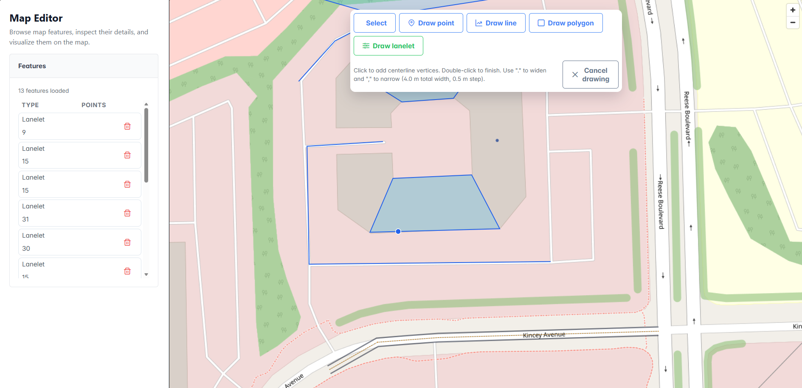

# Case Study: Accelerated Map Editor Scaffolding via Structured AI Workflow

## Title & Summary
This project explores how a single developer, supported by a disciplined AI workflow, rapidly stood up a full spatial Map Editor stack while keeping the codebase clean and extensible. By front‑loading documentation (language instruction sets, PRD, architecture overview, phased implementation plan) the AI was consistently guided to produce manageable, reviewable diffs instead of sprawling rewrites. The intent was not just speed, but to prove that structured prompting, typed boundaries, and early contract generation (OpenAPI + migrations) can compress development time without trading away maintainability or future evolution (drawing & editing tools, vector tiles, performance tuning).

## Background
- Goal: Demonstrate AI-assisted creation of a map editing application that remains easy to extend (editing tools, vector tiles).
- Core Docs Prepared (human + AI co-authored, then refined):
  - Language Instruction Sets: TypeScript & React guidelines (living documents, continuously improved).
  - PRD: Clarified scope via AI-driven clarifying questions, then manually tightened.
  - Architecture: Tech stack, directory layout, responsibility boundaries, diagrams.
  - Plan: High-level phased roadmap favoring rapid progression rather than deeply decomposed tickets.
- Repo: Mono‑repo (API service + web client + docs) with shared coding standards.

## Challenge
- Accelerate delivery while preventing typical AI pitfalls: hallucinations, inconsistent patterns, leaked abstractions, large unreviewable code blocks.
- Balance coarse high-level phases with need for maintainable, evolvable code.
- Avoid rework arising from too broad of instrcutions.

## Approach
1. Instruction Foundation: Create reusable language instruction files; treat them as authoritative references in prompts (reduces repetitive specification overhead).
2. Clarifying Question Loop: For PRD & Architecture, request AI questions first—raise requirement completeness before generation.
3. Layered Artifact Sequence:
    - Instructions → PRD → Architecture → Plan → Implementation phases.
4. High-Level Phases vs Detailed Tickets: Opted for speed—accepted larger generation chunks; noted trade-off (less granular control, risk of adjustments) for future refinement.
5. Implementation Prompt Pattern:
    - Short directive: “Implement Phase X of #Plan.md”. 
    - Provide current repo snapshot or key file excerpts.
6. Tool Duality:
    - ChatGPT Codex (iterative PR creation; ensures lint/build/test pass) for bulk changes.
    - Copilot in-editor for micro-adjustments (naming, minor refactors) to reduce iteration latency.
7. Review & Merge Flow:
    - AI opens PR per phase.
    - Human review: check typing, adherence to layering & instructions; reject drift.
    - Adjust with Copilot; merge when clean.
8. Change Management:
    - Accept that “All Plans Change”: refine docs midstream when generation quality dipped.
    - Occasionally discard AI output, strengthen docs, retry.
9. Drift Prevention Techniques:
    - Explicit reference to source instruction files in prompts.
    - Require domain vs infrastructure separation (e.g., avoid exposing ORM entities).
    - Enforce typed boundaries and configuration centralization.
10. Quality Gates:
    - Lint, build, test checks mandated per PR. AI is able to do this automatically and iterate until no errors.
    - Code review of the PR - ask for refactor if code does not adhere to standards.
    - Manual testing of the application - iterate on bug changes in Copilot.

## Solution
- Code 100% AI generated. When code did not work, or did not meet standards, AI was instructed to fix the issues.
- Rapid scaffold: Core API (Express + tsoa) and frontend shell (React + MapLibre) materialized through phased AI PRs.
- Structured data layer: Feature entity & migrations generated early to anchor later CRUD.
- Typed contracts: OpenAPI spec auto-generated; avoids spec/code divergence.
- Modular frontend: Providers, layout, map component structured for incremental feature implementation.
- End Product: Within a very short amount of time an AI Assisted application was developed that met the requirements laid out in the [text](3-Plan.md)

## Results
- Faster Delivery Cycles
    - Each phase would normally be a Man Sprint of work. Normally sprints occur in weeks, with AI assisted development Phases took hours.
- Improved Quality
    - Before code is written, the Developer's time was focused on ensuring documentation was accurate. Due to increased development time the Developer was able to spend more time on this effort.
    - After code was written the Developer focused attention on ensure the code met stanards and worked as expected.
    - All apsects of the Developer's efforts was focused on quality and not on the mechanics of writing code.
- Adaptability
    - Document set enabled low-friction plan and architecture adjustments midstream.
    - Due to such rapid development times it was easy to decide to throw away a particular change set and try again if the code did not match expectations. Usually this involved enhancing supporting documentation and regenerating code from improved documentation.
- Human Effort Shift: Majority of time spent curating instructions & reviewing diffs rather than writing code.

## Proof
- Instruction Artifacts: Language guidelines reused across prompts (consistency evidence).
- PRD & Architecture revisions show clarifying question incorporation.
- Incremental PR history (one per phase) demonstrating controlled scope.
- Manual correction examples evidencing human quality gate.
- Effort
    - Total project time: ~16hrs spread over several 3 hour sessions
    - ~4 hrs of that time was spent up front generating good documentation to start from
    - Phases completed: 6
        - Each phase would normally be a couple man weeks of development as well as several days in QA
        - Proper QA was not followed in this effort. Normally we would have a test plan and dedicated QA staff to test each set of tasks as well as regression test.
        - Grooming was mostly performed up front with some in between phases to account for functionality that was not thought of up front.

### Git History
The important thing to keep an eye on in this git commit history is the number of commits in each branch. If the AI had gotten the code perfect the first time you would see a single commit per branch. In reality what you see below is it took several commits of refactorings, or clarification of design, to get the code right. In each branch the first commit was generated using _Codex_ using a prompt like `Implement Phase X of the #Plan`. Subsequent commits were from the Developer performing code reviews and quality checks and asking for _Copilot_, within _VS Code_, to make changes.

## Wrap-Up
### Lessons Learned
- High-fidelity instruction files are leverage; treat them as versioned assets.
- Clarifying questions phase increases doc correctness and reduces prompt churn.
- Diff-based generation + micro-tweak split (bulk via Codex, fine-grain via Copilot) optimizes velocity.
- Coarse phases accelerate early momentum but benefit from later ticket granularity for complex features.
- Strategic willingness to discard subpar AI output prevents compounding technical debt.
- Development cycles more closely resemble a waterfall process instead of iterative cycles. AI benefits from having a clearly defined spec up front. This is not to say a design can't change over time, but that the documentation for each iteration should be clearly defined before work starts. The more clearly you define the end product, the better AI will be at generating what you want.

### Future Outlook (Process Evolution)
- Introduce per-phase task breakdown files to tighten scope control.
- Automate pre-merge quality gates (coverage threshold, dependency audit scan, OpenAPI diff check).
- Add AI-assisted ADR index to capture architectural decisions.
- Expand prompt templates for CRUD, auth, automated tests and performance profiling.
- Capture quantitative metrics (iteration counts, review time) for future ROI analysis.

### Closing Summary
A disciplined, document-first AI workflow enabled rapid multi-layer scaffolding while maintaining clean architectural seams. Speed gains derived from reusable instruction assets and controlled diff increments; maintainability preserved through vigilant human review and willingness to refine supporting docs midstream.

---
<!-- 
## Metrics & Data Still Needed
1. Manual baseline estimate vs actual hours per early phase (Foundations, API Scaffold, Frontend Shell).
2. Number of prompts / PRs vs accepted merges (iteration efficiency rate).
3. Average time from AI PR creation to merge (review latency).
4. Count of discarded generations (and primary causes: spec drift, pattern violation, complexity).
5. Defect / rework events post-merge (bugs linked to AI vs human code).
6. Strict typing impact (compile errors caught early vs projected without strict mode).
7. Onboarding feedback from any additional developer (qualitative testimonial).
8. Initial performance snapshot (status endpoint latency, cold start time).
9. Dependency audit state (vulns at first scaffold vs current).
10. Planned schedule for CRUD completion + editing tools start.
11. Subjective satisfaction rating of AI workflow (e.g., 1–10 for speed, maintainability, predictability).

Provide these data points to finalize quantitative Results and Proof sections. -->